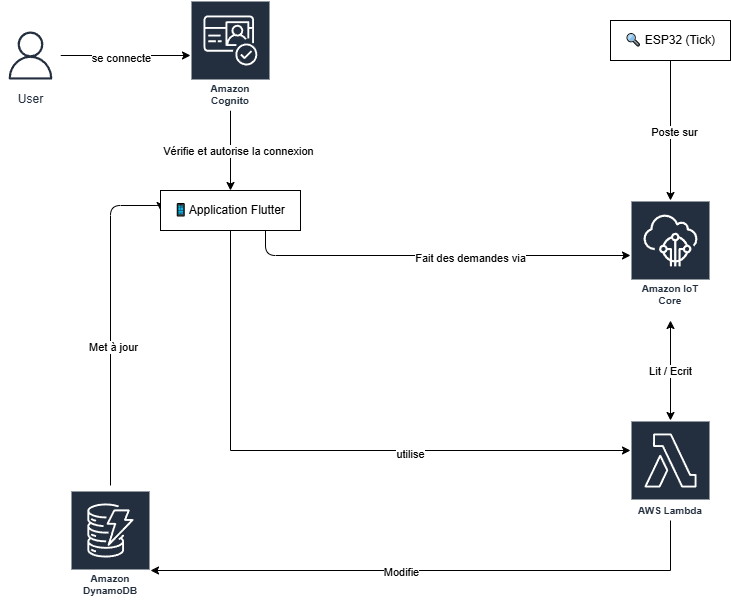

# Documentation du backend AWS pour le projet Tick

Cette section décrit l'architecture et les services AWS utilisés pour le backend du projet "Tick".

## Architecture générale

L'infrastructure backend est entièrement "serverless" et repose sur les services suivants :
*   **AWS IoT Core :** Pour la communication MQTT avec les dispositifs ESP32.
*   **AWS Lambda :** Pour toute la logique métier (API pour l'application, traitement des messages IoT). Les fonctions sont écrites en Python.
*   **Amazon DynamoDB :** Pour le stockage des données (utilisateurs, Ticks, historique des alertes, tokens FCM).
*   **Amazon Cognito :** Pour l'authentification et la gestion des identités des utilisateurs de l'application mobile.
*   **AWS IAM :** Pour la gestion sécurisée des permissions entre tous les services.
*   **Firebase Cloud Messaging (FCM) :** Utilisé pour l'envoi des notifications push, orchestré par une fonction Lambda.

Vous trouverez ci-dessous un diagramme illustrant l'architecture globale :

## Déploiement pour évaluation

L'infrastructure AWS pour ce projet est actuellement déployée et fonctionnelle sur un compte AWS dédié, créé avec une adresse e-mail étudiante et utilisé exclusivement pour ce projet.

La reproduction manuelle de cette infrastructure sur un nouveau compte AWS est un processus complexe impliquant la configuration détaillée de multiples services (DynamoDB avec ses index, chaque fonction Lambda avec son code et ses dépendances, IoT Core avec les certificats et règles, Cognito User Pool et Identity Pool, ainsi que toutes les politiques IAM associées).

Afin de faciliter l'évaluation du backend tout en garantissant la sécurité et la fidélité de la configuration, nous proposons les options suivantes :

1.  **Session de présentation et d'explication de l'infrastructure :** Nous sommes disponibles pour organiser un entretien afin de vous présenter en détail notre architecture AWS, d'expliquer les configurations de chaque service et de répondre à toutes vos questions. Cette session pourrait également servir à guider une éventuelle reproduction partielle ou complète de l'environnement si souhaité.
2.  **Transfert de la propriété du compte AWS dédié :** Étant donné que le compte AWS utilisé a été créé spécifiquement pour ce projet et ne contient aucune autre ressource personnelle ou sensible, nous pouvons, si cela est jugé pertinent pour l'évaluation, procéder au transfert de la propriété de ce compte. Cela impliquerait de changer l'adresse e-mail et le mot de passe du compte racine pour que vous puissiez y avoir un accès complet et direct.

Nous avons exploré des outils d'Infrastructure as Code (IaC) tels que Former2 ou le générateur IaC d'AWS. Cependant, leur mise en œuvre pour exporter et réimporter l'ensemble de cette configuration de manière simple et fiable, sans perte de contexte ou de configurations fines, s'est avérée non triviale dans le cadre et les contraintes de temps de ce projet académique. Nous estimons que les options ci-dessus offrent un moyen plus direct et efficace d'évaluer le travail réalisé sur le backend.

Contact :
*   Message privé Github
*   tickapp.help@gmail.com